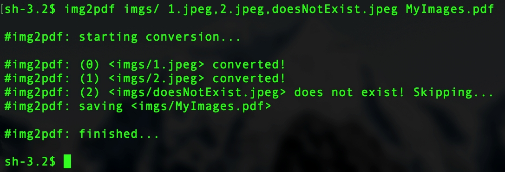

# img2pdf
Image to PDF conversion utility written in D programming language.



### Dependencies (DUB packages)
* [printed](https://github.com/AuburnSounds/printed)

### Usage
```
================================================================
img2pdf  v1.1 -- Image to PDF converter.
----------------------------------------------------------------
USAGE:
	img2pdf [path] [imgs] [file] [stretch]
DEFAULTS:
	[path]	  cwd/ ('/' path identifier)
	[imgs]	  all *.jpg, *.png in path
	[file]	  path/output.pdf
	[stretch] -strue (stretch img to PDF page size)
EXAMPLE:
	img2pdf ../temp/ img1.png,img2.jpg myImages.pdf -sfalse
================================================================
```

### Building
#### Required
* [D compiler](https://dlang.org/download)
* [DUB](https://dub.pm) package manager

#### Compiling
```
git clone https://github.com/rillki/img2pdf.git
cd img2pdf
dub --build=release
```
Your will find the binary in the `bin/` folder. Add it to your path. Enjoy!

### LICENSE
All code is licensed under [MIT](https://github.com/rillki/img2pdf/blob/main/LICENSE) license.
